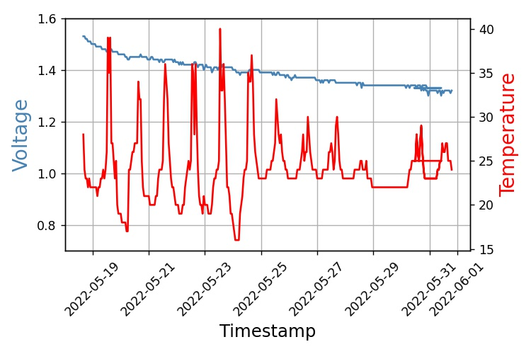
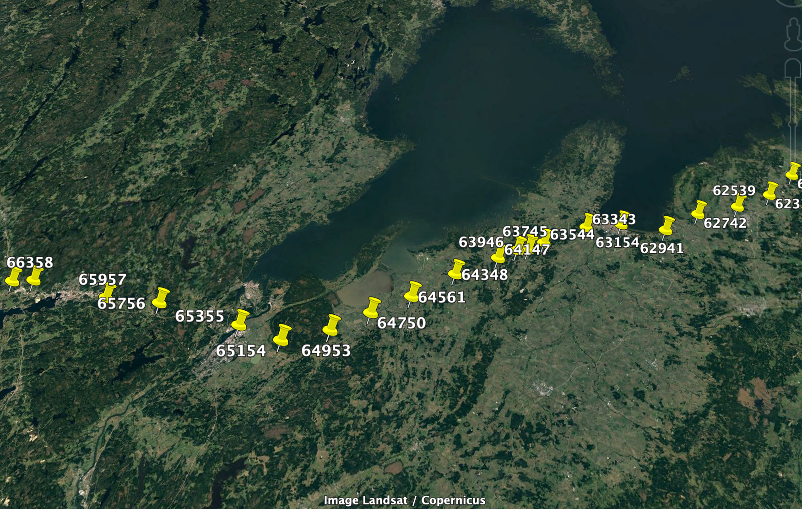

# Useful Python Scripts
Here are some [Jupyter Notebook](https://jupyter.org) scripts for doing basic analysis of the raw data from the database for the [Osan Pathfinder](https://www.osan.tech) GPS tracker.

## *volt\_temp\_plot.ipynb*
This script plots the voltage-temperature graph. It can useful when evaluating/estimating power consumption of various profile settings and battery chemistries.

## *db2kml.ipynb*
This script plots the GPS positions to a KML file for viewing in Google Earth.

-

